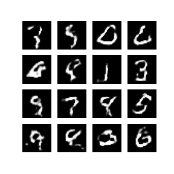
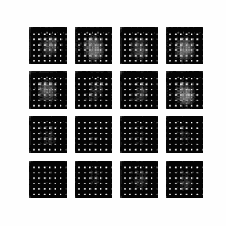
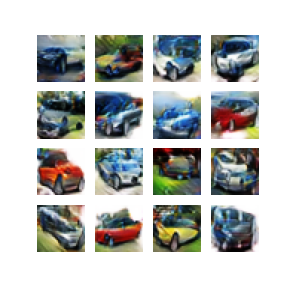

# Deep Convolutional Generative Adversarial Networks

Code to present an application of Deep Convolutional Generative Adversarial Networks for a Medium Article.


These article and code were written with an educationnal purpose, to provide a hands-on application to someone that wants to discover GANs and that has a basic understanding of Convolutionnal Neural Network.


Article: [How to generate realistic pictures with Deep Convolutional GANs?](https://medium.com/dc-gan/how-to-build-deep-gans-to-generate-pictures-328beb40c14)

## Install the dependencies:
```
pip install -r requirements.txt
```


## The repository contains two application of DC-GAN:

1) Generation of digits images from MNIST dataset

<p align="center">
   
  
  <p align="center"> Results after 50 epochs  </p>
</p>


<p align="center">
  
  <p align="center"> 50 epochs training  </p>
</p>


2) Generation of car images from CIFAR10 dataset


<p align="center">
   
  
  <p align="center"> Results after 100 epochs  </p>
</p>


<p align="center">
  
  <p align="center"> 200 epochs training  </p>
</p>


We recommend you to use GPU to run the codes, we personnally used google-colab's free GPUs.

Arthur Pentecoste & Paul-Emile Gras
