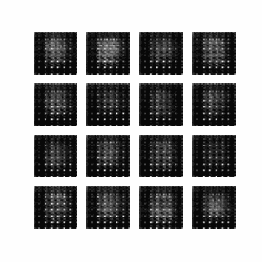

# Deep Convolutional Generative Adversarial Networks

## Code to present an application of Deep Convolutional Generative Adversarial Networks for a Medium Article

Article and code are meant for educationnal purposes and provide a hands-on application to someone that wants to discover GANs that has a basic understanding of Convolutionnal Neural Network.


Article: [article](https://www.google.com)

## Install the dependencies:
```
pip install -r requirements.txt
```


## The repository contains two application of DC-GAN:

1) Generation of digits imagesfrom MNIST dataset

<p align="center">
   
  
  <p align="center"> Results after 50 epochs  </p>
</p>


<p align="center">
  
  <p align="center"> 50 epochs training  </p>
</p>


2) Generation of car images from CIFAR10 dataset


<p align="center">
   
  
  <p align="center"> Results after 100 epochs  </p>
</p>


<p align="center">
  
  <p align="center"> 200 epochs training  </p>
</p>


We recommend to use a GPU to run the models if you don't want the training to take forever
